# 公网平台 MySQL 数据模型

## 状态与决策

- 数据库：MySQL 8.0.16+，InnoDB，`utf8mb4`；不兼容 MariaDB。
- 首版拓扑：单区域、单 Node 应用实例、单主 MySQL；Redis 不进入首版依赖。
- 持久化原则：关系表保存身份、授权、可查询状态和约束；JSON 保存已有复杂领域文档。
- 时间：数据库统一使用 `datetime(6)` 和 UTC，展示时由客户端转换时区。
- 主键：跨边界实体使用随机 UUID；内部纯追加明细可按查询需要使用 UUID 或 bigint。
- 并发：单表约束由数据库兜底，跨表业务不变量由 Repository 事务和锁保证；进程内队列只负责单实例调度体验。

## 建模原则

- 用户私有资源具有唯一 `owner_user_id`，任何读取和写入都由服务端 actor 决定。
- 在线对局是共享资源，通过参与关系授权，不归属于单个用户。
- 揭棋裁判态是服务端机密；普通 DTO、导出和通用用户文档表不得读取。
- 现有 `schemaVersion` 和载荷校验继续保留，写入 JSON 不等于信任客户端 JSON。
- revision 使用单调递增 bigint；更新采用 `WHERE id = ? AND revision = expected_revision`。
- 软删除只用于需要恢复或审计的业务；不为所有表无差别增加 `deleted_at`。
- 外键删除行为逐个声明，禁止依赖默认级联。
- 首版不把每个变招节点和棋盘格关系化，避免扩大迁移面。

## 逻辑关系

```mermaid
erDiagram
  USERS ||--|| USER_PROFILES : has
  USERS ||--o{ AUTH_IDENTITIES : authenticates
  USERS ||--o| PASSWORD_CREDENTIALS : owns
  USERS ||--o{ SESSIONS : opens
  USERS ||--o{ ACCOUNT_TOKENS : receives
  USERS ||--o{ SECURITY_EVENTS : causes

  USERS ||--o{ MATCH_PARTICIPANTS : joins
  MATCHES ||--o{ MATCH_PARTICIPANTS : contains
  MATCHES ||--|| MATCH_STATES : owns
  MATCHES ||--o{ MATCH_INVITES : issues
  MATCHES ||--o{ MATCH_CHAT_MESSAGES : contains
  MATCHES ||--o| MATCH_CHAT_SETTINGS : configures
  MATCHES ||--o{ MATCH_PROPOSALS : tracks

  USERS ||--o{ USER_GAMES : owns
  USERS ||--o{ STUDIES : owns
  USERS ||--o{ TRAINING_TASKS : owns
  USERS ||--o{ CUSTOM_ENDGAMES : owns
  USERS ||--o{ ENDGAME_FAVORITES : owns
  USERS ||--o{ RECENT_POSITIONS : owns
  USERS ||--o{ JIEQI_SEAT_RECORDS : owns
  USERS ||--o{ GOMOKU_GAME_RECORDS : owns
  USERS ||--o| USER_SETTINGS : owns
  USERS ||--o{ DATA_IMPORT_JOBS : starts
```



## 身份与账号表

### `users`

| 字段                    | 类型          | 约束/说明                                                                   |
| ----------------------- | ------------- | --------------------------------------------------------------------------- |
| `id`                    | `char(36)`    | 主键，服务端随机生成                                                        |
| `status`                | text/enum     | `pending_verification/active/restricted/suspended/pending_deletion/deleted` |
| `auth_epoch`            | `bigint`      | 权限或凭据整体失效版本，默认 0                                              |
| `created_at`            | `datetime(6)` | 非空                                                                        |
| `updated_at`            | `datetime(6)` | 非空                                                                        |
| `deletion_requested_at` | `datetime(6)` | 可空                                                                        |
| `deletion_due_at`       | `datetime(6)` | 可空                                                                        |
| `deleted_at`            | `datetime(6)` | 可空                                                                        |

约束：

- `pending_deletion` 必须同时具有请求和到期时间。
- `deleted` 必须具有 `deleted_at`，且不能重新变为 active。
- 状态或安全凭据变化时同步增加 `auth_epoch`。

### `user_profiles`

| 字段                        | 类型          | 约束/说明                                |
| --------------------------- | ------------- | ---------------------------------------- |
| `user_id`                   | `char(36)`    | 主键，外键 `users(id) ON DELETE CASCADE` |
| `display_name`              | `text`        | 2～20 字符，允许重复                     |
| `avatar_object_key`         | `text`        | 首版为空，P2 对象存储使用                |
| `locale`                    | `text`        | 首版默认 `zh-CN`                         |
| `created_at` / `updated_at` | `datetime(6)` | 非空                                     |

公开 DTO 只返回允许字段，不返回邮箱或账号状态内部原因。

### `auth_identities`

| 字段                        | 类型          | 约束/说明                          |
| --------------------------- | ------------- | ---------------------------------- |
| `id`                        | `char(36)`    | 主键                               |
| `user_id`                   | `char(36)`    | 外键 `users(id) ON DELETE CASCADE` |
| `provider`                  | `text`        | 首版固定 `email`                   |
| `identifier_normalized`     | `text`        | 规范化邮箱，敏感字段               |
| `identifier_display`        | `text`        | 原始/显示邮箱，敏感字段            |
| `verified_at`               | `datetime(6)` | 可空                               |
| `created_at` / `updated_at` | `datetime(6)` | 非空                               |

约束：

- `(provider, identifier_normalized)` 在未删除身份中唯一。
- 首版每个用户最多一个 email identity；表结构保留以后绑定其他身份的能力。
- 邮箱不进入公开 profile、对局快照或聊天作者字段。

### `password_credentials`

| 字段            | 类型          | 约束/说明                                |
| --------------- | ------------- | ---------------------------------------- |
| `user_id`       | `char(36)`    | 主键，外键 `users(id) ON DELETE CASCADE` |
| `password_hash` | `text`        | Argon2id 编码串，永不返回                |
| `hash_version`  | `integer`     | 便于参数升级                             |
| `changed_at`    | `datetime(6)` | 非空                                     |

### `sessions`

| 字段                  | 类型          | 约束/说明                                |
| --------------------- | ------------- | ---------------------------------------- |
| `id`                  | `char(36)`    | 主键，对用户可展示为设备会话 ID          |
| `user_id`             | `char(36)`    | 外键 `users(id) ON DELETE CASCADE`       |
| `token_hash`          | `binary(32)`  | 唯一，只保存随机 token 摘要              |
| `auth_epoch`          | `bigint`      | 创建时用户 epoch 快照                    |
| `csrf_secret_hash`    | `binary(32)`  | 会话绑定 CSRF 秘密摘要                   |
| `created_at`          | `datetime(6)` | 非空                                     |
| `last_seen_at`        | `datetime(6)` | 节流更新                                 |
| `idle_expires_at`     | `datetime(6)` | 非空                                     |
| `absolute_expires_at` | `datetime(6)` | 非空                                     |
| `revoked_at`          | `datetime(6)` | 可空                                     |
| `device_label`        | `text`        | 截断后的用户可读摘要，不存完整指纹       |
| `last_ip_prefix`      | `varchar(45)` | 可选、脱敏精度，供安全提示，不作身份依据 |

有效会话条件由统一查询函数定义：未撤销、未过两个期限、epoch 匹配、用户状态允许。

### `account_tokens`

统一保存邮箱验证、密码恢复和删除恢复 token：

| 字段                        | 类型          | 约束/说明                                      |
| --------------------------- | ------------- | ---------------------------------------------- |
| `id`                        | `char(36)`    | 主键                                           |
| `user_id`                   | `char(36)`    | 外键，删除用户时级联                           |
| `purpose`                   | `text`        | `verify_email/reset_password/recover_deletion` |
| `token_hash`                | `binary(32)`  | 唯一                                           |
| `created_at` / `expires_at` | `datetime(6)` | 非空                                           |
| `used_at` / `revoked_at`    | `datetime(6)` | 可空                                           |

同一用户同一 purpose 只允许一条未使用、未撤销、未过期 token；创建新 token 时在事务中撤销旧 token。

### `security_events`

只存安全事件元数据：`id/user_id/session_id/type/result/ip_prefix/user_agent_summary/created_at/metadata`。`metadata` 不允许密码、token、完整邮箱、请求体或聊天正文。默认保留 180 天。

## 在线对局表

### `matches`

| 字段                         | 类型          | 约束/说明                                                       |
| ---------------------------- | ------------- | --------------------------------------------------------------- |
| `id`                         | `char(36)`    | 主键，一盘一 ID                                                 |
| `variant`                    | `text`        | `xiangqi/jieqi/gomoku`                                          |
| `gomoku_rule`                | `text`        | 五子棋必填，其他为空                                            |
| `matchmaking`                | `boolean`     | 是否由快速匹配创建                                              |
| `visibility`                 | `text`        | `public/invite/private`                                         |
| `phase`                      | `text`        | `waiting/playing/finished`                                      |
| `status`                     | `text`        | `playing/red-wins/black-wins/draw`                              |
| `status_reason`              | `text`        | 复用现有服务端原因集合                                          |
| `revision`                   | `bigint`      | 每次权威状态变化递增                                            |
| `previous_match_id`          | `char(36)`    | 可空，再来一局关联，不形成可变房间                              |
| `created_by_user_id`         | `char(36)`    | 原始创建者审计引用；当前 owner 权限以 participant.is_owner 为准 |
| `created_at` / `updated_at`  | `datetime(6)` | 非空                                                            |
| `started_at` / `finished_at` | `datetime(6)` | 可空                                                            |
| `expires_at`                 | `datetime(6)` | 历史清理时间，按策略生成                                        |

核心检查约束与当前 `StoredRoom` 一致：playing 必须有双方棋手，finished 必须是非 playing 结果，gomoku rule 与 variant 匹配。

### `match_participants`

| 字段                    | 类型          | 约束/说明                                 |
| ----------------------- | ------------- | ----------------------------------------- |
| `id`                    | `char(36)`    | 主键                                      |
| `match_id`              | `char(36)`    | 外键 `matches(id) ON DELETE CASCADE`      |
| `user_id`               | `char(36)`    | 可空；账号最终删除后去标识化              |
| `side`                  | `text`        | `red/black` 或空                          |
| `is_owner`              | `boolean`     | 是否为创建/管理成员；可以同时占据红黑席位 |
| `display_name_snapshot` | `text`        | 对局昵称快照                              |
| `ready`                 | `boolean`     | waiting 阶段使用                          |
| `hints_used`            | `smallint`    | 现有上限 0～3                             |
| `joined_at` / `left_at` | `datetime(6)` | 可空                                      |
| `anonymized_at`         | `datetime(6)` | 可空                                      |

有效参与关系的唯一约束通过可空生成列实现：离场记录的生成列为 `NULL`，未离场记录生成 side/user/owner 唯一键。

- 同一 match 只有一个未离开的 red 和一个未离开的 black。
- 同一用户在同一 match 只有一个有效参与关系；owner 通过 `is_owner` 表达，可以同时具有 side。
- `is_owner=true` 必须与 match 当前创建/管理关系一致，不能由客户端自行写入。

实时观众在线状态首版留在内存，不为每个短连接写参与者表；只有需要历史/治理的观众事件另行记录。

### `match_states`

| 字段             | 类型          | 约束/说明                           |
| ---------------- | ------------- | ----------------------------------- |
| `match_id`       | `char(36)`    | 主键，外键级联                      |
| `schema_version` | `integer`     | 非空                                |
| `revision`       | `bigint`      | 必须与 matches revision 同事务更新  |
| `public_state`   | `json`        | 可安全生成大厅/公开快照所需权威字段 |
| `referee_state`  | `json`        | 服务端机密，揭棋包含完整裁判态      |
| `updated_at`     | `datetime(6)` | 非空                                |

规则：

- 普通象棋和五子棋也通过权威状态校验，不信任客户端快照。
- 揭棋 `referee_state` 只能由专用 Repository 读取，禁止通用 `SELECT *` DTO 映射。
- public/seat projection 从权威事件正向生成；不持久化三份可漂移的派生投影。
- move/state/revision/终局更新在同一事务中提交。

### `match_invites`

保存 `id/match_id/created_by_user_id/token_hash/allowed_side/expires_at/used_by_user_id/used_at/revoked_at/created_at`。

- 原始 token 只出现在创建响应/邀请 URL，数据库与日志只存摘要。
- 使用邀请通过条件更新原子完成：未使用、未撤销、未过期、目标席位仍空。
- 成功加入后用户身份来自 `match_participants`，不再用 invite token 订阅和走子。

### `match_chat_messages`

保存 `id/match_id/sequence/author_user_id/display_name_snapshot/role_snapshot/content/created_at/deleted_at/deletion_reason/moderation_state`。

- `(match_id, sequence)` 唯一，sequence 在数据库事务中单调递增。
- `author_user_id` 在账号删除后置空；昵称按共享历史策略匿名化。
- 删除正文默认 24 小时内清理；被举报消息的证据副本进入独立受限存储。
- 正常聊天正文保留 30 天，之后清理；对局历史不依赖聊天存在。

### `match_chat_settings` 与 `match_proposals`

- chat settings 一局一行，保存全员禁言和房间策略；敏感词是否持久化在治理设计后决定。
- 需要跨重启恢复的悔棋、议和、换边提案保存 kind、发起方、deadline、状态和 revision。
- 短时 UI 状态可以缓存，但数据库状态是重启恢复来源。

## 用户私有内容表

每类内容独立建表，不使用一个无类型约束的万能 `user_documents` 表。共同字段为：

```text
id char(36) primary key
owner_user_id char(36) not null references users(id)
schema_version integer not null
revision bigint not null
payload json not null
created_at datetime(6) not null
updated_at datetime(6) not null
client_mutation_id char(36) null
```

具体表：

- `user_games`：增加 name、mode、status、move_count 查询摘要。
- `studies`：增加 name、description、search_text、current_node_id 摘要。
- `training_tasks`：增加 state、source_type、source_id、dedupe_key、last_practiced_at。
- `custom_endgames`：增加 name、tags、goal 摘要。
- `jieqi_seat_records`：增加 match_id、audience side；payload 只允许席位投影。
- `gomoku_game_records`：增加 mode、rule、winner、move_count。
- `recent_positions`：payload 可以较小，但仍执行 FEN 校验并限制每用户数量。
- `user_settings`：一用户一行，区分账号偏好与设备特定设置。
- `data_import_jobs`：保存 import_id、分类计数、状态、错误摘要和结果，不保存原始 token。

关系表：

- `endgame_favorites(owner_user_id, catalog_kind, endgame_id, created_at)`。
- 训练来源和研究来源采用可空外键/显式引用；来源删除后保留训练 payload 快照并将引用标记失效。

约束：

- `(owner_user_id, client_mutation_id)` 在 client mutation 非空时唯一，支持网络重试幂等。
- 所有按 ID 更新同时匹配 owner 和 expected revision。
- 训练 dedupe key 只在 owner 范围内唯一。
- 最近局面、五子棋历史等有每用户硬上限和确定清理顺序。

## 用户隔离与 Repository 约束

MySQL 没有原生 Row-Level Security，应用层授权和限定查询是主防线：

- 私有资源 Repository 必须接收由已认证 actor 派生的 `owner_user_id`，不得接收客户端提交的 user ID 作为授权依据。
- 按 ID 读取、更新和删除必须在同一条 SQL 中同时匹配 `id`、`owner_user_id`，更新还要匹配 `expected_revision`。
- 不提供绕过 owner 条件的通用私有资源查询；后台任务使用单独接口、账号和审计链路。
- 不通过 MySQL session 变量保存当前用户，避免连接池复用时发生身份串用。
- shared match 通过参与关系和专用查询授权；migration、备份和运行应用使用不同的最小权限账号。
- A/B 用户反向越权测试覆盖所有私有资源，是隔离回归的必过门槛。

## 数据保留与删除策略

以下是首版产品默认值，部署前按实际运营地区复核：

| 数据               | 默认保留                     | 账号删除                                          |
| ------------------ | ---------------------------- | ------------------------------------------------- |
| 活跃会话           | 最长 30 天                   | 提交删除时立即撤销，最终物理删除                  |
| 验证/恢复 token    | 过期后 7 天清理摘要          | 立即撤销，随后清理                                |
| 安全事件           | 180 天                       | user_id 去标识化，按安全期限清理                  |
| 用户私有内容       | 账号存续期间                 | 30 天恢复期后物理删除                             |
| 在线对局及参与关系 | 完成后 365 天                | 保留另一方历史，删除方 user_id 置空并匿名化       |
| 揭棋裁判态         | 随对局，最长 365 天          | 不因单方删除提前破坏另一方记录；到期随 match 删除 |
| 正常聊天正文       | 30 天                        | 作者去标识化；正文按原到期时间清理                |
| 已删除未举报消息   | 最多额外 24 小时             | 到期物理清理正文                                  |
| 举报证据           | 180 天或案件关闭后的配置期限 | 受限留存，禁止普通接口读取                        |
| 邀请               | 过期/使用后 7 天             | 原始 token 从不存储，摘要到期清理                 |

共享对局匿名化：

- 删除方先在事务中将 `match_participants.user_id` 置空并记录 `anonymized_at`，参与者外键使用 `ON DELETE RESTRICT` 防止跳过匿名化直接删除账号。
- 对外昵称快照改为“已注销用户”，不保留可关联邮箱或用户 ID。
- 对手仍可查看棋局和自己有权获得的揭棋席位投影。
- 删除方无法在注销后重新认领旧参与关系。

## 索引与查询基线

首版至少覆盖：

- `auth_identities(provider, identifier_normalized)` 唯一索引。
- `sessions(token_hash)` 唯一索引和 `(user_id, revoked_at, absolute_expires_at)`。
- `matches(phase, visibility, variant, created_at desc)` 大厅索引。
- `matches(finished_at desc)` 历史清理索引。
- `match_participants(user_id, match_id)`，以及由可空生成列实现的有效 user/side/owner 唯一键。
- `match_invites(token_hash)` 唯一索引和 expires 索引。
- `match_chat_messages(match_id, sequence)` 唯一索引。
- 各私有表 `(owner_user_id, updated_at desc)` 和 owner/client mutation 唯一索引。

JSON 默认不全量索引。只有真实查询需要搜索 payload 内部字段时，才增加经过评估的生成列或函数索引；列表查询优先使用校验后的关系摘要，避免每次扫描大型变招树。

## 事务边界

### 创建账号

`users + profile + identity + credential + verification token` 同事务提交；事务提交后使用仍在请求内存中的原始 token 发送邮件。投递失败不回滚账号，用户可以受限重发并在事务中撤销旧 token；如以后引入可靠 outbox，必须单独解决一次性原始 token 的加密存储和清理。

### 快速匹配

在事务中锁定一个候选 waiting match，验证空席和用户当前队列状态，创建 participant 并递增 match revision。无候选则创建 match 和首位 participant。进程内队列不能代替数据库条件更新。

### 落子

锁定/条件更新 match 和 state，校验 participant side、turn、phase、expected revision、command id，再由规则核心产生新状态；state、revision、终局和持久命令去重同事务提交。

### 完成对局

终局状态、finished_at、参与者结果和未来等级分结算引用同一 match revision。等级分尚未上线时不预建不可验证的分数结果。

### 账号删除

第一事务立即进入 pending deletion、增加 auth epoch 并撤销会话；随后 job 幂等取消匹配/等待席位，并通过权威对局状态机结束仍在 playing 的参与关系。最终清理必须等活跃占位处理完成且恢复期到期，再分批删除私有资源并匿名化共享关系；任务可从中断位置安全重试。

## migration 与兼容策略

- migration 只向前执行，文件按不可变序号纳入版本控制。
- MySQL DDL 会隐式提交，不能把整批 DDL 描述为可回滚事务；迁移通过 `GET_LOCK` 串行执行、逐条应用并在成功后记录校验和。
- 已发布 migration 不得修改；失败后先确认已生效的原子 DDL，再修复环境并安全重跑，不提供自动 down migration。
- 应用发布遵循“扩展 schema → 部署兼容代码 → 切换写路径 → 观察 → 后续清理”。
- 不在应用普通启动流程中自动创建或猜测生产表。
- 第一个数据库版本从空库开始，不自动导入当前 `data/games`、`data/rooms` 或浏览器数据。
- LAN JSON Repository 保持原行为，公网 MySQL Repository 通过显式场景选择。
- 如以后决定迁移旧服务端 JSON，使用独立一次性工具，包含 dry-run、坏数据报告、幂等键和回滚清单。

## 备份恢复一致性检查

恢复演练必须验证：

- 用户、identity、credential 和 session 外键一致。
- playing match 的 participant、revision 和 match state 一致。
- 揭棋 referee state 能重新生成红、黑、公开三种正确投影。
- match/chat sequence 单调且唯一。
- 用户私有 payload 通过当前 schema 校验，不因恢复绕过验证。
- 生成列、检查约束、外键、索引和应用数据库角色权限随 schema 一起恢复。

`mysqldump`/`mysql` 用于逻辑备份和恢复验证；生产环境还应结合托管 MySQL 的时间点恢复能力，并定期在独立空库执行恢复演练。

## 第一批数据库实现输入

下一批只建立以下最小集合和 Repository 接口，不一次创建全部 P1 用户内容表：

1. migration 元数据与数据库健康检查。
2. `users/user_profiles/auth_identities/password_credentials/sessions/account_tokens`。
3. `matches/match_participants/match_states/match_invites` 的基础 schema。
4. 账号、会话、match 和通用 user document 的 Repository 接口。
5. 空库 migration、上一 migration 升级、事务回滚和断线测试基线。

聊天和全部用户内容可以按各自实现批次落 migration，但命名、主键、actor、Repository 隔离和删除边界不得偏离本文档。
